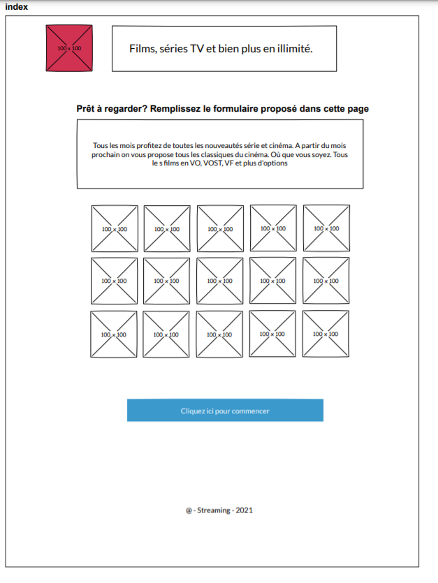
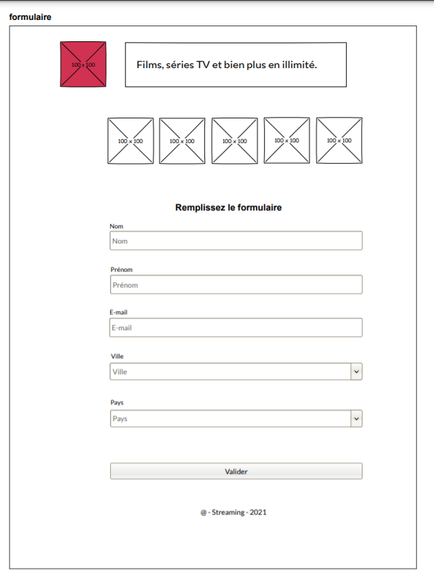

# PPE Cinéma :

↪ [Lien vers le site](https://abane1.github.io/PPE_Cinema_v-1/)

## Développement d’une page publicitaire pour la Maison de ligues

Une agence nous confie la réalisation d’une page publicitaire pour 
la Maison de ligues sur le web. La promotion a pour but de 
conquérir des nouveaux abonné(e)s, en proposant la diffusion de 
toutes les compétitions sportives. Pour cela on nous a conseillé d’abord 
d’analyser toutes les fonctionnalités au travers des deux wireframes (présent ci-dessous). 
Les spécifications pour le fonctionnement de chaque partie ne sont 
pas définies. Nous devions réaliser la charte graphique.
Pour commencer nous devions tout simplement mettre en place une 
structure html sémantique car le contenu de cette publication est 
destiné à tout public, et penser à produire un code optimisé pour les 
moteurs de recherche à l’indexation de l’information.

### Phases de réalisation

- [x] Créer un répertoire de travail.
- [x] Commencer le travail par une maquette statique (sans css).
- [x] Valider la maquette dans le validateur W3C.
- [ ] Respecter les emplacements des éléments vus dans les wireframes.
- [ ] Commencer à réfléchir pour le fonctionnement du formulaire.
- [ ] Penser au développement de la page à partir de 0 : sans Framework.
- [ ] Après l’intégration de la charte graphique, revenir sur les
fonctionnalités et se préparer à intégrer dans la maquette des
fonctionnalités.
- [ ] Trouver la meilleure méthode pour reproduire des événements : envoie des requêtes et réponses coté serveur.

# Index 

# Formulaire

